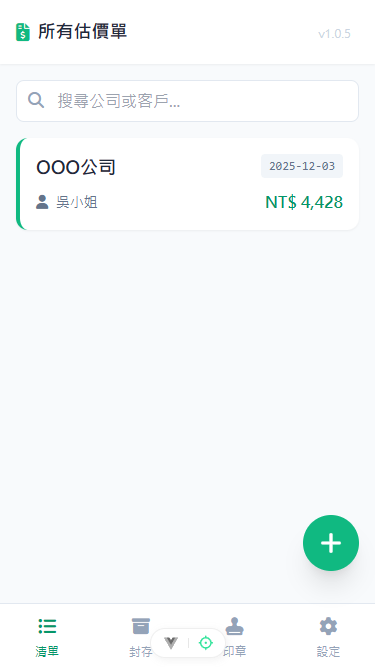
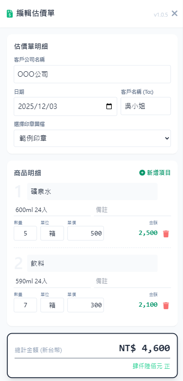

# 專業估價單助手 (Quotation Generator)

一個基於 Vue 3 + Vite + Tailwind CSS 開發的輕量級估價單產生器。
專為行動裝置優先設計 (Mobile-First)，資料完全儲存於瀏覽器端 (LocalStorage)，無需架設後端伺服器即可使用。




## ✨ 主要功能
* **📝 估價單管理**：建立、編輯、刪除估價單，支援商品明細增刪。
* **💾 智慧自動儲存**：
    * 編輯內容變更時自動觸發儲存 (Debounce 防抖機制)。
    * 只有內容與上次存檔不同時才會執行寫入，優化效能。
    * 提供視覺化「已自動儲存」通知。
* **🖼️ 圖片匯出與分享**：
    * 一鍵將估價單轉換為高解析度 PNG 圖片。
    * 支援 Web Share API，在手機上可直接喚起 LINE、Email 等分享選單。
    * 自動嵌入公司/個人印章圖檔 (支援去背疊加效果)。
* **📂 封存機制**：可將歷史報價單封存，保持工作列表整潔，並隨時還原。
* **🛡️ 資料備份**：支援完整的 JSON 格式資料匯出與匯入，方便跨裝置轉移資料。
* **🔍 搜尋功能**：快速搜尋客戶名稱或公司名稱。

## 🛠️ 使用技術
* [Vue 3](https://vuejs.org/) (Composition API, `<script setup>`)
* [Vite](https://vitejs.dev/)
* [Tailwind CSS](https://tailwindcss.com/)
* [FontAwesome](https://fontawesome.com/) (圖標庫)
* [html2canvas](https://html2canvas.hertzen.com/) (網頁截圖)

## 🚀 快速開始

### 1. 安裝依賴

確保你的環境已安裝 Node.js，然後執行：

```bash
npm install
```

### 2. 開發模式 (Development)

```bash
npm run dev
```

### 建置生產版本 (Production)

```bash
npm run build
```

## ⚠️ 常見問題與注意事項
+ 圖片跨域問題 (CORS)
若您的印章圖片來自外部 URL，請確保該伺服器支援 CORS，否則 html2canvas 截圖時可能會變成空白。本專案預設使用 Base64 或本地上傳預覽，可避免此問題。
