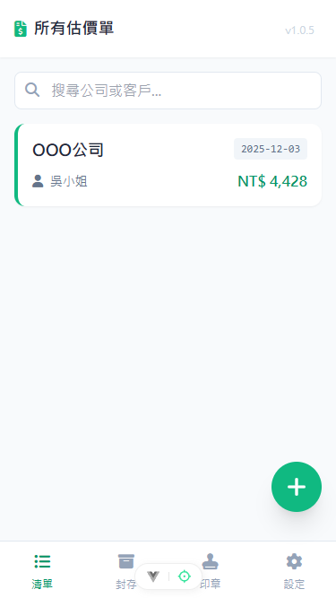
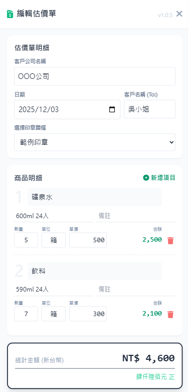

# 專業估價單助手 (Quotation Generator)

一個基於 Vue 3 + Vite + Tailwind CSS 開發的輕量級估價單產生器。
專為行動裝置優先設計 (Mobile-First)，資料完全儲存於瀏覽器端 (LocalStorage)，無需架設後端伺服器即可使用。




## ✨ 主要功能
* **📝 估價單管理**：建立、編輯、刪除估價單，支援商品明細增刪。
* **💾 智慧自動儲存**：
    * 編輯內容變更時自動觸發儲存 (Debounce 防抖機制)。
    * 只有內容與上次存檔不同時才會執行寫入，優化效能。
    * 提供視覺化「已自動儲存」通知。
* **🖼️ 圖片匯出與分享**：
    * 一鍵將估價單轉換為高解析度 PNG 圖片。
    * 支援 Web Share API，在手機上可直接喚起 LINE、Email 等分享選單。
    * 自動嵌入公司/個人印章圖檔 (支援去背疊加效果)。
* **📂 封存機制**：可將歷史報價單封存，保持工作列表整潔，並隨時還原。
* **🛡️ 資料備份**：支援完整的 JSON 格式資料匯出與匯入，方便跨裝置轉移資料。
* **🔍 搜尋功能**：快速搜尋客戶名稱或公司名稱。

## 🛠️ 使用技術
* [Vue 3](https://vuejs.org/) (Composition API, `<script setup>`)
* [Vite](https://vitejs.dev/)
* [Tailwind CSS](https://tailwindcss.com/)
* [FontAwesome](https://fontawesome.com/) (圖標庫)
* [html2canvas](https://html2canvas.hertzen.com/) (網頁截圖)

## 🚀 快速開始

### 1. 安裝依賴

確保你的環境已安裝 Node.js，然後執行：

```bash
npm install
```

### 2. 開發模式 (Development)

```bash
npm run dev
```

### 建置生產版本 (Production)

```bash
npm run build
```

## 📱 Android App (Capacitor)

本專案同時透過 [Capacitor](https://capacitorjs.com/) 打包為原生 Android App，資料改存於 App 自身的沙盒空間
（`@capacitor/preferences`），不受瀏覽器 Chrome 清除資料/解除安裝更新影響。GitHub Pages 上的 Web/PWA 版本
與 Android App 共用同一份程式碼，透過 `Capacitor.isNativePlatform()` 自動切換儲存與分享方式，兩者互不影響。

### 需求

* Node.js（同上）
* [Android Studio](https://developer.android.com/studio)（含 Android SDK）
* JDK 17

### 建置與開啟專案

```bash
npm run build:android   # 以相對路徑建置 + 同步進 android/ 專案
npx cap open android    # 用 Android Studio 開啟，即可執行到模擬器/實機
```

`npm run build:android` 會用 `CAP_BUILD=1` 讓 `vite.config.js` 改用相對路徑（`./`）而非 GitHub Pages 的
`/quotation-editor/`，並不影響一般 `npm run build` / `npm run deploy` 的 GitHub Pages 部署行為。

### ⚠️ 簽章（Signing）— 務必妥善保存 keystore

Release APK **必須使用自建的簽章金鑰**，且日後每次更新版本都要用**同一把 keystore** 重新簽署，
否則使用者無法直接覆蓋安裝新版（需先移除舊版才能裝新版），導致 App 內既有資料遺失。

```bash
keytool -genkey -v -keystore quotation-release.keystore -alias quotation -keyalg RSA -keysize 2048 -validity 10000
```

請將產生的 keystore 檔案與密碼另外妥善備份（**不要**提交進 git），並在 Android Studio 的
Build → Generate Signed Bundle / APK 流程中選擇此 keystore。**不要**用 debug 簽章長期發佈，
debug key 遺失或變動同樣會導致無法覆蓋安裝。

### 首次安裝的資料遷移

由於 Android App 的儲存空間與網頁版 Chrome 的 `localStorage` 完全獨立，兩者資料不會自動互通。
若使用者先前已用網頁版累積了估價單資料，需先在**網頁版**「設定」頁匯出 JSON 備份，
再到 **App 版**「設定」頁匯入。App 首次啟動且尚無任何資料時，會自動顯示一次性的提示畫面說明此流程。

## ⚠️ 常見問題與注意事項
+ 圖片跨域問題 (CORS)
若您的印章圖片來自外部 URL，請確保該伺服器支援 CORS，否則 html2canvas 截圖時可能會變成空白。本專案預設使用 Base64 或本地上傳預覽，可避免此問題。
